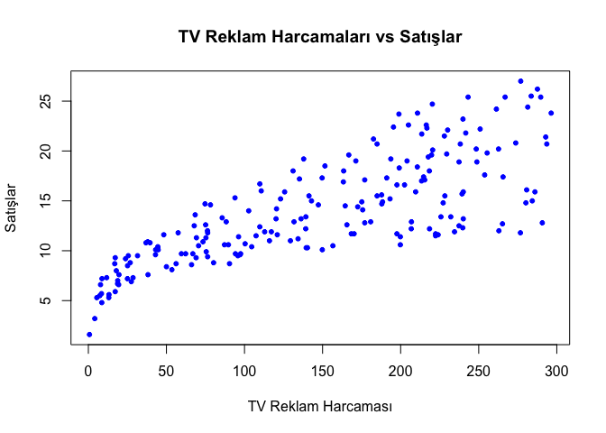
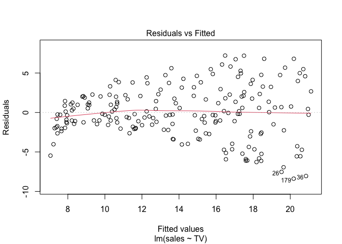
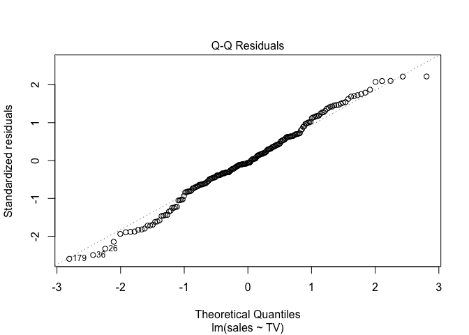
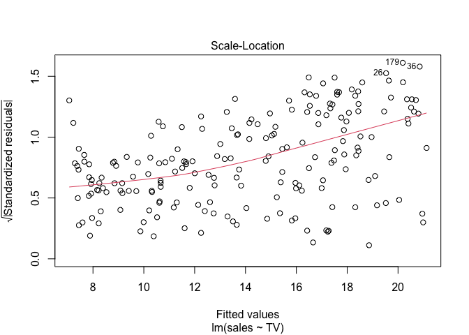
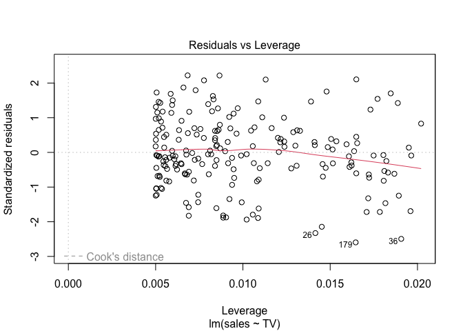

Advertising and Auto Data Analysis
================
Berat Mert Kayacan
2026-04-08

``` r
advertising = read.csv("Advertising.csv", header=T, na.strings="?")
dim(advertising) # veri seti boyutları
```

    ## [1] 200   4

``` r
names(advertising) # sütun isimleri 
```

    ## [1] "TV"        "radio"     "newspaper" "sales"

``` r
summary(advertising) # özet istatistikler
```

    ##        TV             radio          newspaper          sales      
    ##  Min.   :  0.70   Min.   : 0.000   Min.   :  0.30   Min.   : 1.60  
    ##  1st Qu.: 74.38   1st Qu.: 9.975   1st Qu.: 12.75   1st Qu.:10.38  
    ##  Median :149.75   Median :22.900   Median : 25.75   Median :12.90  
    ##  Mean   :147.04   Mean   :23.264   Mean   : 30.55   Mean   :14.02  
    ##  3rd Qu.:218.82   3rd Qu.:36.525   3rd Qu.: 45.10   3rd Qu.:17.40  
    ##  Max.   :296.40   Max.   :49.600   Max.   :114.00   Max.   :27.00

``` r
attach(advertising) # değişkenlere doğrudan isimleriyle erişebilmek için 
```

``` r
# Plot ile TV ve Sales ilişkisi 
plot(TV, sales, main="TV Reklam Harcamaları vs Satışlar", 
     xlab="TV Reklam Harcaması", ylab="Satışlar", col="blue", pch=20)
```

<!-- -->
Fitting the Model:

``` r
model = lm(sales ~ TV, data = advertising) #modeli oluşturma 
summary(model) # modelin özetini göster
```

    ## 
    ## Call:
    ## lm(formula = sales ~ TV, data = advertising)
    ## 
    ## Residuals:
    ##     Min      1Q  Median      3Q     Max 
    ## -8.3860 -1.9545 -0.1913  2.0671  7.2124 
    ## 
    ## Coefficients:
    ##             Estimate Std. Error t value Pr(>|t|)    
    ## (Intercept) 7.032594   0.457843   15.36   <2e-16 ***
    ## TV          0.047537   0.002691   17.67   <2e-16 ***
    ## ---
    ## Signif. codes:  0 '***' 0.001 '**' 0.01 '*' 0.05 '.' 0.1 ' ' 1
    ## 
    ## Residual standard error: 3.259 on 198 degrees of freedom
    ## Multiple R-squared:  0.6119, Adjusted R-squared:  0.6099 
    ## F-statistic: 312.1 on 1 and 198 DF,  p-value: < 2.2e-16

``` r
plot(model) #diagnostic 4 plot 
```

<!-- --><!-- --><!-- --><!-- -->

MULTİPLE LİNEAR REGRESSİON

``` r
model = lm(sales ~ TV + radio + newspaper, data = advertising)
summary(model)
```

    ## 
    ## Call:
    ## lm(formula = sales ~ TV + radio + newspaper, data = advertising)
    ## 
    ## Residuals:
    ##     Min      1Q  Median      3Q     Max 
    ## -8.8277 -0.8908  0.2418  1.1893  2.8292 
    ## 
    ## Coefficients:
    ##              Estimate Std. Error t value Pr(>|t|)    
    ## (Intercept)  2.938889   0.311908   9.422   <2e-16 ***
    ## TV           0.045765   0.001395  32.809   <2e-16 ***
    ## radio        0.188530   0.008611  21.893   <2e-16 ***
    ## newspaper   -0.001037   0.005871  -0.177     0.86    
    ## ---
    ## Signif. codes:  0 '***' 0.001 '**' 0.01 '*' 0.05 '.' 0.1 ' ' 1
    ## 
    ## Residual standard error: 1.686 on 196 degrees of freedom
    ## Multiple R-squared:  0.8972, Adjusted R-squared:  0.8956 
    ## F-statistic: 570.3 on 3 and 196 DF,  p-value: < 2.2e-16

MULTİPLE REGRESSION - AUTO DATASET

``` r
Auto = read.csv("Auto.csv", header=T, na.strings="?", stringsAsFactors = T) # Auto verisetini yükle (na.strings eksik değerler için)
summary(Auto)
```

    ##       mpg          cylinders      displacement     horsepower        weight    
    ##  Min.   : 9.00   Min.   :3.000   Min.   : 68.0   Min.   : 46.0   Min.   :1613  
    ##  1st Qu.:17.50   1st Qu.:4.000   1st Qu.:104.0   1st Qu.: 75.0   1st Qu.:2223  
    ##  Median :23.00   Median :4.000   Median :146.0   Median : 93.5   Median :2800  
    ##  Mean   :23.52   Mean   :5.458   Mean   :193.5   Mean   :104.5   Mean   :2970  
    ##  3rd Qu.:29.00   3rd Qu.:8.000   3rd Qu.:262.0   3rd Qu.:126.0   3rd Qu.:3609  
    ##  Max.   :46.60   Max.   :8.000   Max.   :455.0   Max.   :230.0   Max.   :5140  
    ##                                                  NA's   :5                     
    ##   acceleration        year           origin                  name    
    ##  Min.   : 8.00   Min.   :70.00   Min.   :1.000   ford pinto    :  6  
    ##  1st Qu.:13.80   1st Qu.:73.00   1st Qu.:1.000   amc matador   :  5  
    ##  Median :15.50   Median :76.00   Median :1.000   ford maverick :  5  
    ##  Mean   :15.56   Mean   :75.99   Mean   :1.574   toyota corolla:  5  
    ##  3rd Qu.:17.10   3rd Qu.:79.00   3rd Qu.:2.000   amc gremlin   :  4  
    ##  Max.   :24.80   Max.   :82.00   Max.   :3.000   amc hornet    :  4  
    ##                                                  (Other)       :368

``` r
model_auto = lm(mpg ~ cylinders + displacement + horsepower + 
                 weight + acceleration + year + origin, data = Auto) # auto modeli kur 
summary(model_auto) # sonuçları özetle 
```

    ## 
    ## Call:
    ## lm(formula = mpg ~ cylinders + displacement + horsepower + weight + 
    ##     acceleration + year + origin, data = Auto)
    ## 
    ## Residuals:
    ##     Min      1Q  Median      3Q     Max 
    ## -9.5903 -2.1565 -0.1169  1.8690 13.0604 
    ## 
    ## Coefficients:
    ##                Estimate Std. Error t value Pr(>|t|)    
    ## (Intercept)  -17.218435   4.644294  -3.707  0.00024 ***
    ## cylinders     -0.493376   0.323282  -1.526  0.12780    
    ## displacement   0.019896   0.007515   2.647  0.00844 ** 
    ## horsepower    -0.016951   0.013787  -1.230  0.21963    
    ## weight        -0.006474   0.000652  -9.929  < 2e-16 ***
    ## acceleration   0.080576   0.098845   0.815  0.41548    
    ## year           0.750773   0.050973  14.729  < 2e-16 ***
    ## origin         1.426141   0.278136   5.127 4.67e-07 ***
    ## ---
    ## Signif. codes:  0 '***' 0.001 '**' 0.01 '*' 0.05 '.' 0.1 ' ' 1
    ## 
    ## Residual standard error: 3.328 on 384 degrees of freedom
    ##   (5 observations deleted due to missingness)
    ## Multiple R-squared:  0.8215, Adjusted R-squared:  0.8182 
    ## F-statistic: 252.4 on 7 and 384 DF,  p-value: < 2.2e-16
