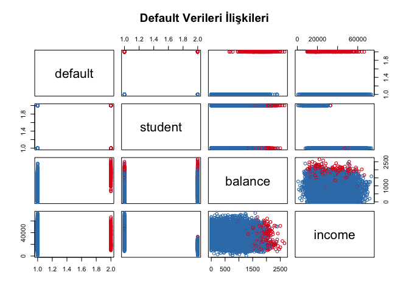

Logistic Regression Analysis
================
Berat Mert Kayacan

``` r
library(ISLR)
names(Default)
```

    ## [1] "default" "student" "balance" "income"

``` r
dim(Default)
```

    ## [1] 10000     4

``` r
summary(Default)
```

    ##  default    student       balance           income     
    ##  No :9667   No :7056   Min.   :   0.0   Min.   :  772  
    ##  Yes: 333   Yes:2944   1st Qu.: 481.7   1st Qu.:21340  
    ##                        Median : 823.6   Median :34553  
    ##                        Mean   : 835.4   Mean   :33517  
    ##                        3rd Qu.:1166.3   3rd Qu.:43808  
    ##                        Max.   :2654.3   Max.   :73554

``` r
#pairs(Default) yazarsan düz sadece matrix verir
pairs # scatterplot matrix renklendirilmiş, düzenlenmiş.
```

    ## function (x, ...) 
    ## UseMethod("pairs")
    ## <bytecode: 0x1249b5710>
    ## <environment: namespace:graphics>

``` r
colors <- ifelse(Default$default == "Yes", "#E41A1C", "#377EB8") 
pairs(Default, col = colors, main = "Default Verileri İlişkileri")
```

<!-- -->

Logistic Regression

``` r
library(ISLR)
library(caTools)
set.seed(42) # hep aynı 8000 veriyi al(her çalıştırışta farklı alıp farklı tahminler yapmasın diye kullanılır)
sample = sample.split(Default$default, SplitRatio = 0.8) # Default datasetinde default değişkenini ayır
trainData = subset(Default, sample == TRUE) # 8000 satır training için ayrıldı
testData  = subset(Default, sample == FALSE) # 2000 satır test için ayrıldı
glm.fits = glm(default ~ balance, data = trainData, family = binomial) # modeli oluştur(balance'a bakarak P(x)= B0 + B1x ---> x balance)
summary(glm.fits)
```

    ## 
    ## Call:
    ## glm(formula = default ~ balance, family = binomial, data = trainData)
    ## 
    ## Coefficients:
    ##               Estimate Std. Error z value Pr(>|z|)    
    ## (Intercept) -1.049e+01  3.958e-01  -26.51   <2e-16 ***
    ## balance      5.418e-03  2.428e-04   22.31   <2e-16 ***
    ## ---
    ## Signif. codes:  0 '***' 0.001 '**' 0.01 '*' 0.05 '.' 0.1 ' ' 1
    ## 
    ## (Dispersion parameter for binomial family taken to be 1)
    ## 
    ##     Null deviance: 2333.8  on 7999  degrees of freedom
    ## Residual deviance: 1302.8  on 7998  degrees of freedom
    ## AIC: 1306.8
    ## 
    ## Number of Fisher Scoring iterations: 8

coefficients intercept = B0 balance = B1

Model 1: Sadece Balance giriş

``` r
glm.probs = predict(glm.fits, testData, type="response") #testData da test et ve olasılıkları hesapla
glm.pred = rep("No", 2000) # predictiona dönüştür
glm.pred[glm.probs > 0.5] = "Yes" # olasılıkları trashhold ile kıyasla fazlaysa Yes'e döndür
table(glm.pred, testData$default) # Diagonaldekilerin toplamı doğru tahmin sayısını verir
```

    ##         
    ## glm.pred   No  Yes
    ##      No  1922   42
    ##      Yes   11   25

``` r
mean(glm.pred == testData$default) # %97 ihtimalle doğru tahminler verir bu model.
```

    ## [1] 0.9735
