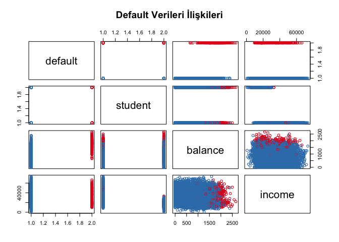

Logistic Regression on the Default Data Set
================
Berat Mert Kayacan

## Default veri setine ilk bakış

``` r
library(ISLR)
names(Default)
```

    ## [1] "default" "student" "balance" "income"

``` r
dim(Default)
```

    ## [1] 10000     4

``` r
summary(Default)
```

    ##  default    student       balance           income     
    ##  No :9667   No :7056   Min.   :   0.0   Min.   :  772  
    ##  Yes: 333   Yes:2944   1st Qu.: 481.7   1st Qu.:21340  
    ##                        Median : 823.6   Median :34553  
    ##                        Mean   : 835.4   Mean   :33517  
    ##                        3rd Qu.:1166.3   3rd Qu.:43808  
    ##                        Max.   :2654.3   Max.   :73554

``` r
# kredi ödememe durumuna göre renklendirilmiş saçılım matrisi
colors <- ifelse(Default$default == "Yes", "#E41A1C", "#377EB8")
pairs(Default, col = colors, main = "Default Verileri İlişkileri")
```

<!-- -->

## Eğitim ve test ayrımı ile model kurulumu

Kesme terimi B0, balance katsayısı ise B1 olarak okunur.

``` r
library(caTools)
set.seed(42) # her çalıştırmada aynı ayrımı elde etmek için
sample <- sample.split(Default$default, SplitRatio = 0.8) # default değişkenine göre tabakalı ayrım
trainData <- subset(Default, sample == TRUE) # 8000 satır eğitim için
testData <- subset(Default, sample == FALSE) # 2000 satır test için
glm_fit <- glm(default ~ balance, data = trainData, family = binomial) # P(default) ~ balance
summary(glm_fit)
```

    ## 
    ## Call:
    ## glm(formula = default ~ balance, family = binomial, data = trainData)
    ## 
    ## Coefficients:
    ##               Estimate Std. Error z value Pr(>|z|)    
    ## (Intercept) -1.049e+01  3.958e-01  -26.51   <2e-16 ***
    ## balance      5.418e-03  2.428e-04   22.31   <2e-16 ***
    ## ---
    ## Signif. codes:  0 '***' 0.001 '**' 0.01 '*' 0.05 '.' 0.1 ' ' 1
    ## 
    ## (Dispersion parameter for binomial family taken to be 1)
    ## 
    ##     Null deviance: 2333.8  on 7999  degrees of freedom
    ## Residual deviance: 1302.8  on 7998  degrees of freedom
    ## AIC: 1306.8
    ## 
    ## Number of Fisher Scoring iterations: 8

## Test kümesinde başarım

``` r
glm_probs <- predict(glm_fit, testData, type = "response") # test kümesi olasılıkları
glm_pred <- rep("No", nrow(testData))
glm_pred[glm_probs > 0.5] <- "Yes" # 0.5 eşiğine göre sınıfa çevir
table(glm_pred, testData$default) # karışıklık matrisi, köşegen doğru tahminler
```

    ##         
    ## glm_pred   No  Yes
    ##      No  1922   42
    ##      Yes   11   25

``` r
mean(glm_pred == testData$default) # doğruluk oranı
```

    ## [1] 0.9735
