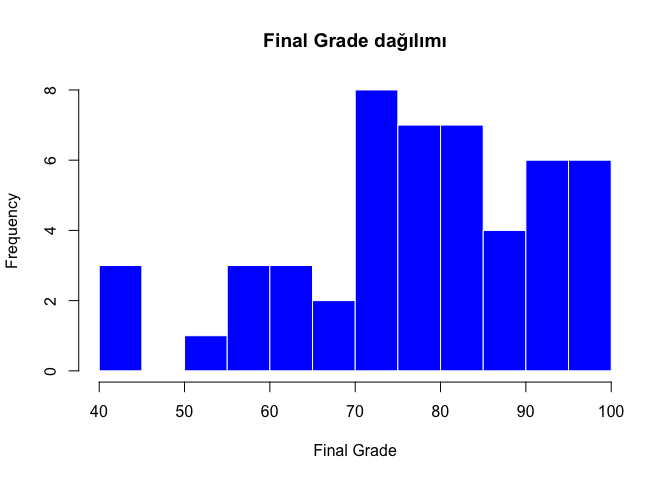
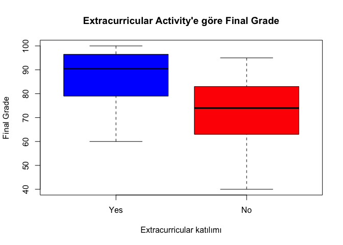
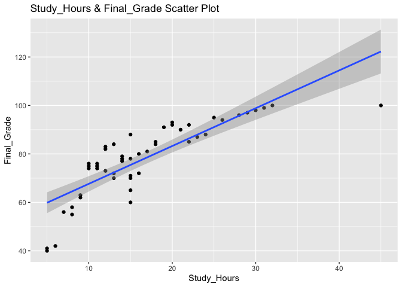
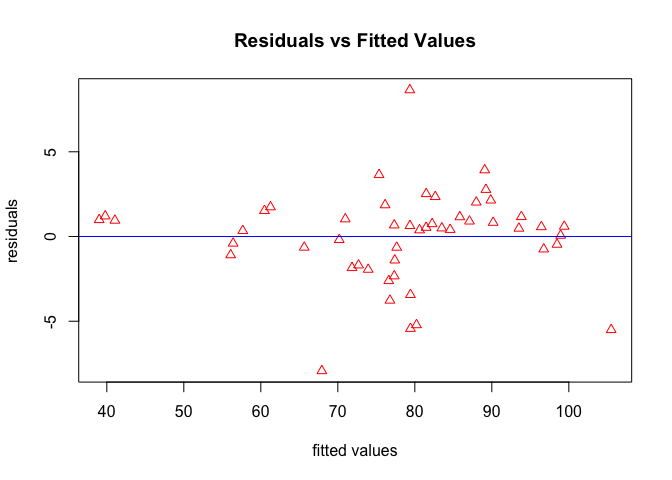
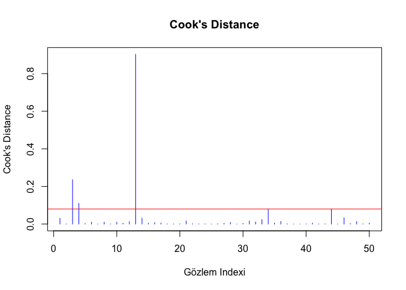

Student Performance Regression Analysis
================
Berat Mert Kayacan
2026-05-05

## Veri setinin oluşturulması

Veri, tekrarlanabilirlik için sabit bir tohumla kod içinde üretiliyor.
Eksik değerler, tutarsız kategori yazımları ve mantık dışı gözlemler
bilinçli olarak veriye yerleştirilmiş.

``` r
set.seed(42)
df_assignment <- data.frame(
  Student_ID = 1:50,
  Study_Hours = c(10, 12, NA, 15, 8, 20, 22, 5, 30, NA, 14, 18, 45, 11, 9, 21, 25, 13, 16, 28,
                  10, 12, 14, NA, 8, 19, 23, 6, 31, 15, 14, 18, 12, 11, 9, 22, 26, 13, 17, 29,
                  10, 13, 15, 11, 7, 20, 24, 5, 32, 16),
  Attendance_Rate = c(0.85, 0.90, 0.70, NA, 0.60, 0.95, 0.88, 0.40, 1.0, 0.75, 0.82, NA, 1.20, 0.88, 0.65,
                      0.92, 0.98, 0.76, 0.84, 0.99, 0.85, 0.91, 0.83, 0.68, 0.62, 0.96, 0.89, 0.42, 1.0, 0.77,
                      0.81, 0.87, 0.84, 0.89, 0.66, 0.93, 0.97, 0.75, 0.85, 0.98, 0.86, 0.92, 0.82, 0.88, 0.61,
                      0.94, 0.90, 0.41, 1.0, 0.78),
  Extracurricular = c("Yes", "no", "YES", "No", "no ", "Yes", "No", "no", "Yes", "YES", "No", "Yes", "Yes", "No", "no",
                      "Yes", "No", "no", "Yes", "Yes", "No", "No", "Yes", "no", "No", "Yes", "No", "no", "Yes", "No",
                      "No", "Yes", "No", "No", "no", "Yes", "No", "no", "Yes", "Yes", "No", "No", "Yes", "No", "No",
                      "Yes", "No", "no", "Yes", "No"),
  Final_Grade = c(75, 82, 60, 88, 55, 92, 85, 40, 98, 70, 78, 84, 250, 76, 62, 90, 95, 72, 80, 96,
                  74, 83, 77, 65, 58, 91, 87, 42, 99, 71, 79, 85, 73, 75, 63, 92, 94, 70, 81, 97,
                  76, 84, 78, 74, 56, 93, 88, 41, 100, 72)
)
```

``` r
head(df_assignment)
```

    ##   Student_ID Study_Hours Attendance_Rate Extracurricular Final_Grade
    ## 1          1          10            0.85             Yes          75
    ## 2          2          12            0.90              no          82
    ## 3          3          NA            0.70             YES          60
    ## 4          4          15              NA              No          88
    ## 5          5           8            0.60             no           55
    ## 6          6          20            0.95             Yes          92

``` r
str(df_assignment)
```

    ## 'data.frame':    50 obs. of  5 variables:
    ##  $ Student_ID     : int  1 2 3 4 5 6 7 8 9 10 ...
    ##  $ Study_Hours    : num  10 12 NA 15 8 20 22 5 30 NA ...
    ##  $ Attendance_Rate: num  0.85 0.9 0.7 NA 0.6 0.95 0.88 0.4 1 0.75 ...
    ##  $ Extracurricular: chr  "Yes" "no" "YES" "No" ...
    ##  $ Final_Grade    : num  75 82 60 88 55 92 85 40 98 70 ...

## Task 1: Veri temizliği

``` r
colSums(is.na(df_assignment))
```

    ##      Student_ID     Study_Hours Attendance_Rate Extracurricular     Final_Grade 
    ##               0               3               2               0               0

``` r
df_assignment$Study_Hours[is.na(df_assignment$Study_Hours)] <- median(df_assignment$Study_Hours, na.rm = TRUE)

df_assignment$Attendance_Rate[is.na(df_assignment$Attendance_Rate)] <- median(df_assignment$Attendance_Rate, na.rm = TRUE)
colSums(is.na(df_assignment))
```

    ##      Student_ID     Study_Hours Attendance_Rate Extracurricular     Final_Grade 
    ##               0               0               0               0               0

Eksik değerlerin yerine medyan kullanılması tercih edilmiştir çünkü
medyan, aykırı değerlerden etkilenmeyen dirençli bir merkezi eğilim
ölçüsüdür. Medyan ortadaki değeri aldığı için uç gözlemlerden etkilenmez
ve daha temsili ve doğru bir atama sağlar.

``` r
unique(df_assignment$Extracurricular)
```

    ## [1] "Yes" "no"  "YES" "No"  "no "

``` r
df_assignment$Extracurricular <- trimws(df_assignment$Extracurricular)
df_assignment$Extracurricular <- tolower(df_assignment$Extracurricular)
df_assignment$Extracurricular <- ifelse(df_assignment$Extracurricular == "yes", "Yes", "No")
df_assignment$Extracurricular <- factor(df_assignment$Extracurricular, levels = c("Yes", "No"))

levels(df_assignment$Extracurricular)
```

    ## [1] "Yes" "No"

``` r
table(df_assignment$Extracurricular)
```

    ## 
    ## Yes  No 
    ##  20  30

Extracurricular sütunundaki değerler Yes ve No olacak şekilde
düzenleniyor.

- `trimws` baştaki ve sondaki boşlukları siler
- `tolower` tüm değerleri küçük harfe çevirir
- `ifelse` değerleri Yes ve No olarak yeniden yazar
- `factor` sütunu iki seviyeli kategorik değişkene dönüştürür

``` r
df_assignment$Final_Grade[df_assignment$Final_Grade > 100] <- 100
df_assignment$Attendance_Rate[df_assignment$Attendance_Rate > 1] <- 1

max(df_assignment$Final_Grade)
```

    ## [1] 100

``` r
max(df_assignment$Attendance_Rate)
```

    ## [1] 1

Mantık dışı ve aykırı değerler winsorization ile düzeltiliyor. Bu yöntem
gözlemi veri setinden atmak yerine mantıklı sınıra çektiği için veri
kaybı yaşanmıyor.

- 100 üzerindeki notlar 100 e çekiliyor
- 1 üzerindeki devam oranları 1 e çekiliyor

## Task 2: Keşifsel veri analizi

``` r
hist(df_assignment$Final_Grade,
     main = "Final Grade dağılımı",
     xlab = "Final Grade",
     ylab = "Frequency",
     col  = "blue",
     border = "white",
     breaks = 10)
```

<!-- -->

``` r
boxplot(Final_Grade ~ Extracurricular,
        data  = df_assignment,
        main  = "Extracurricular Activity'e göre Final Grade",
        xlab  = "Extracurricular katılımı",
        ylab  = "Final Grade",
        col   = c("blue", "red"))
```

<!-- -->
Ekstra aktivite varsa not yüksek mi karşılaştırması ( “~” sayesinde
final grade ile extracurricuları karşılaştır)

## Task 3: Korelasyon analizi

``` r
#pearson
pearson_r <- cor(df_assignment$Study_Hours,
                 df_assignment$Final_Grade,
                 method = "pearson")
#spearman
spearman_r <- cor(df_assignment$Study_Hours,
                  df_assignment$Final_Grade,
                  method = "spearman")
print(paste("pearson r:" , round(pearson_r , 3)))
```

    ## [1] "pearson r: 0.828"

``` r
print(paste("spearman r: " , round(spearman_r , 3)))
```

    ## [1] "spearman r:  0.872"

Pearson (0.828) ve Spearman (0.872) katsayıları arasındaki fark oldukça
küçük çıktı. Her iki katsayı da güçlü pozitif bir ilişkiye işaret
etmektedir. İki katsayı yakın çıktığı için Study_Hours ile Final_Grade
arasındaki ilişkinin büyük ölçüde doğrusal diyebiliriz. Spearman’ın az
da olsa yüksek çıkması doğrusal olmayan bir ilişki olduğunu fakat
istatistiksel olarak önemsiz olduğunu söyler.

## Task 4: Regresyon modeli

``` r
model <- lm(Final_Grade ~ Study_Hours + Attendance_Rate + Extracurricular,
            data = df_assignment)
summary(model)
```

    ## 
    ## Call:
    ## lm(formula = Final_Grade ~ Study_Hours + Attendance_Rate + Extracurricular, 
    ##     data = df_assignment)
    ## 
    ## Residuals:
    ##     Min      1Q  Median      3Q     Max 
    ## -7.9275 -1.0032  0.5127  1.1626  8.6492 
    ## 
    ## Coefficients:
    ##                   Estimate Std. Error t value Pr(>|t|)    
    ## (Intercept)        6.04905    2.77580   2.179   0.0345 *  
    ## Study_Hours        0.46906    0.07702   6.090 2.12e-07 ***
    ## Attendance_Rate   78.34648    3.87223  20.233  < 2e-16 ***
    ## ExtracurricularNo -0.72032    0.94833  -0.760   0.4514    
    ## ---
    ## Signif. codes:  0 '***' 0.001 '**' 0.01 '*' 0.05 '.' 0.1 ' ' 1
    ## 
    ## Residual standard error: 2.78 on 46 degrees of freedom
    ## Multiple R-squared:  0.9686, Adjusted R-squared:  0.9665 
    ## F-statistic: 472.3 on 3 and 46 DF,  p-value: < 2.2e-16

Final_Grade bağımlı değişken seçilmişken bağımsız değişkenlerden
Study_Hours ve Attendance_Rate p\<0.05 olduğu için model için
anlamlılardır fakat Extracurricular (0.4514 \> 0.05) anlamsızdır

## Task 5: Model başarımı

``` r
tahmin_degerler <- model$fitted.values
gercek_degerler <- df_assignment$Final_Grade
rmse <- sqrt(mean((gercek_degerler - tahmin_degerler)^2))
print(paste("RMSE = " , round(rmse , 3)))
```

    ## [1] "RMSE =  2.666"

0’a yakın çıktı R kare ile tutarlı model iyi çalışıyor. 100 Puanda 2.66
puanlık hata yapıyor.

## Task 6: Yorumlama

``` r
summary(model)
```

    ## 
    ## Call:
    ## lm(formula = Final_Grade ~ Study_Hours + Attendance_Rate + Extracurricular, 
    ##     data = df_assignment)
    ## 
    ## Residuals:
    ##     Min      1Q  Median      3Q     Max 
    ## -7.9275 -1.0032  0.5127  1.1626  8.6492 
    ## 
    ## Coefficients:
    ##                   Estimate Std. Error t value Pr(>|t|)    
    ## (Intercept)        6.04905    2.77580   2.179   0.0345 *  
    ## Study_Hours        0.46906    0.07702   6.090 2.12e-07 ***
    ## Attendance_Rate   78.34648    3.87223  20.233  < 2e-16 ***
    ## ExtracurricularNo -0.72032    0.94833  -0.760   0.4514    
    ## ---
    ## Signif. codes:  0 '***' 0.001 '**' 0.01 '*' 0.05 '.' 0.1 ' ' 1
    ## 
    ## Residual standard error: 2.78 on 46 degrees of freedom
    ## Multiple R-squared:  0.9686, Adjusted R-squared:  0.9665 
    ## F-statistic: 472.3 on 3 and 46 DF,  p-value: < 2.2e-16

R^2 değeri 0.9686 yani 1’e yakın bu da demek oluyor ki model %96 lık bir
notu doğru şekilde açıklıyor. Study_Hours anlamlı olduğu için p\<0.05 bu
independent variable 1 birim artarken 0.469 katsayısı olduğu için
Final_Grade 0.469 puan artar (!diğer değişkenler sabit kalmak koşuluyla)

## Task 7: Regresyon görselleştirmesi

``` r
library(ggplot2)

ggplot(df_assignment, aes(x = Study_Hours, y = Final_Grade)) +
  geom_point() +
  geom_smooth(method = "lm") +
  labs(
    title = "Study_Hours & Final_Grade Scatter Plot",
    x     = "Study_Hours",
    y     = "Final_Grade")
```

    ## `geom_smooth()` using formula = 'y ~ x'

<!-- -->
Study_Hours ile Final_Grade arasında güçlü ve pozitif bir doğrusal
ilişki vardır çünkü veri noktaları regresyon çizgisine yakın toplanmış.
Gölgeli alan dar -\> model güvenilir. Sonuç olarak model veriyi iyi
açıklar R^2 ve Pearson r ile de tutarlı sonuç elde edildi.

## Task 8: Artık analizi

``` r
residuals_vals <- model$residuals
fitted_vals <- model$fitted.values

plot(fitted_vals , residuals_vals,
     main = "Residuals vs Fitted Values",
     xlab = "fitted values",
     ylab = "residuals",
     pch = 24,
     col = "red")

abline(h = 0, col = "blue")
```

<!-- -->
Residualların sıfır çizgisi etrafında büyük ölçüde randomly dağılmış,
funnel shape veya U shape yok yani linearity ve constant variance
varsayımlarının sağlandığını söyler. Model güvenilir kabul edilebilir.

## Bonus: Yüksek etkili gözlemler

``` r
#cooks distance ne olduğu ve işleyişi için yapay zekadan destek alındı

# 1. Cook's Distance hesapla
cooks_d <- cooks.distance(model)
plot(cooks_d,
     type = "h",
     main = "Cook's Distance",
     xlab = "Gözlem Indexi",
     ylab = "Cook's Distance",
     col  = "blue")

#Eşik çizgisi ekle
abline(h = 4/nrow(df_assignment) , col = "red")
```

<!-- -->

``` r
#Eşiği aşan gözlemler
influential <- which(cooks_d > 4/nrow(df_assignment))
print(paste("Influential observations:", influential))
```

    ## [1] "Influential observations: 3"  "Influential observations: 4" 
    ## [3] "Influential observations: 13"

Cook’s Distance grafiğinde görüldüğü gibi 3, 4 ve 13 numaralı
gözlemlerin eşik değeri olan 0.08’i aşmıştır. Özellikle 13 numaralı
gözlem yaklaşık 0.85 Cook’s Distance değeriyle model için problemdir. Bu
gözlem, veri temizleme aşamasında tespit edilen ve 250 olan Final_Grade
değerinin 100’e düzeltildiği gözleme denk geliyor. Söz konusu gözlem
modelin katsayılarını orantısız biçimde etkileme potansiyeline sahip
olmakla birlikte, winsorization ile düzeltilmiş olması etkisini
sınırlandırıyor.
